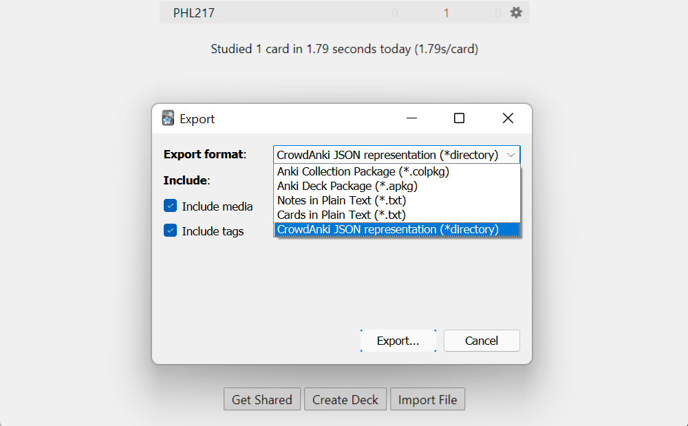

# PHL217 Continental Philosophy
A repository for PHL217: Continental Philosophy

## Sharing Anki Decks

We use CrowdAnki to share Anki Decks. The CrowdAnki addon page can be found [here](https://ankiweb.net/shared/info/1788670778). 

When sharing Anki decks, export the deck using CrowdAnki json format. This enables simpler version control of decks (resulting in simple merges when multiple collaborators add cards to the deck). Avoid using the default Anki .apkg, as the .apkg format is not plain text and has some processing done to it.

### Exporting Decks

To export decks in .json format,
* Ensure that the CrowdAnki addon is installed properly. Please refer to [this](https://ankiweb.net/shared/info/1788670778) for more info. 
* Refer to the screenshot below after selecting the deck to export to choose the .json format:

### Importing Decks

To import a deck, you can directly import the Anki deck from the github by selecting `CrowdAnki: Import git repository` and pasting in the URL of this github repository.

> https://github.com/Stepheny755/PHL217
